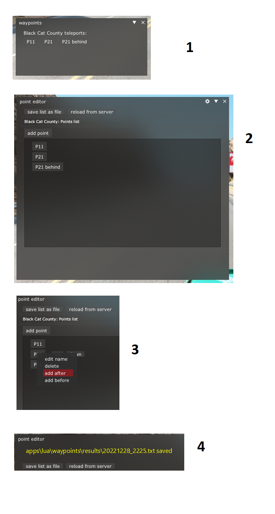

# waypoints plugin

Плагин для assetto corsa для телепорта по серверным точкам телепорта.

# Установка
закинуть папку waypoints в `...\assettocorsa\apps\lua`

# Использование
## Точки телепорта
Точки телепорта читаются из Custom Shader Patch (CSP) `extra options` (скрин пункт 1)

`group` каждой точки должно совпадать с именем запущенной трассы.
Так что советую добавлять и редактировать точки телепорта через
point editor

## point editor
point editor (скрин пункт 2)
Так же как и основное меню загружает точки из `extra options`.
Но еще позволяет добавлять, и редактировать точки по списку
### добавление 
1) через кнопку `add point`
2) правой кнопкой по точке и добавить через `add before` или `add after` (скрин пункт 3)

### сохранение
Обновленный список точек сохраняется в папку `results` (скрин пункт 4)

## Замена точек
Для замены точек нужно остановить сервер и заменить все точки в конфиге на точки из файла руками

---

  
Скрин

  

